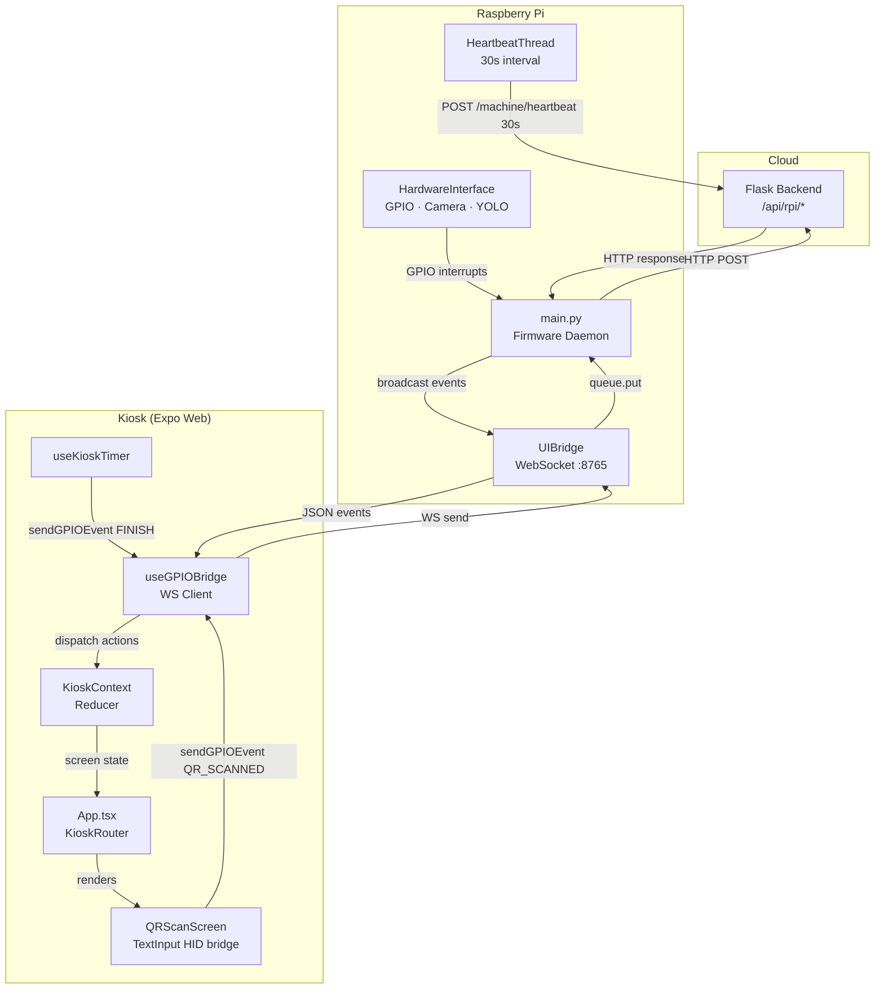
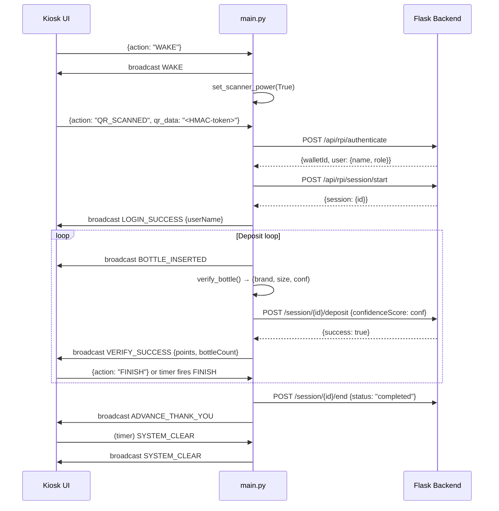
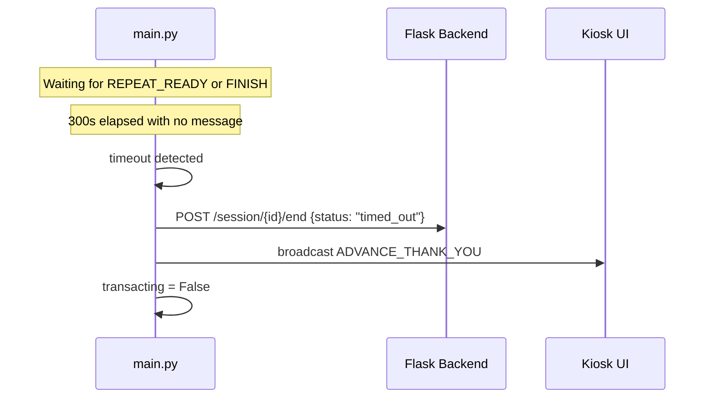
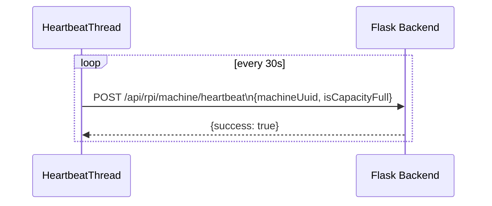
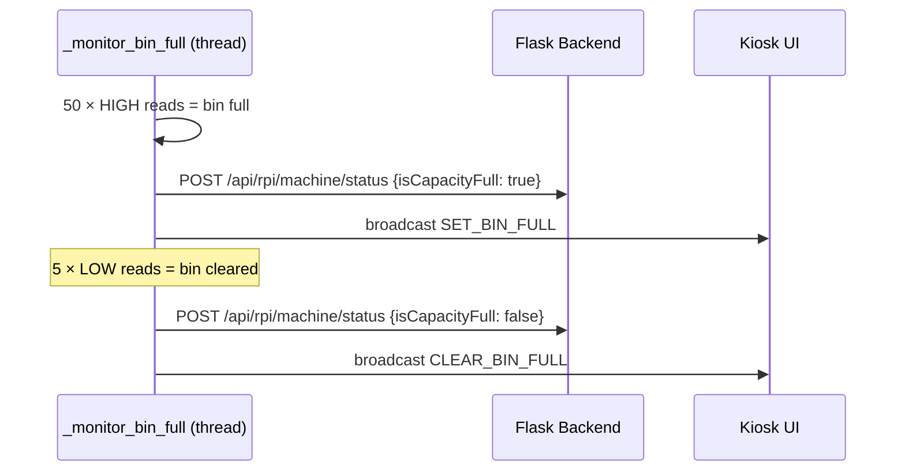

# Design Document: rvm-firmware-completion

## Overview

The EcoPoints RVM firmware (`main.py`) and its React Native kiosk UI (`ui/`) are partially implemented. This document covers completing and hardening the 12 identified gaps into a production-ready edge client. All changes are strictly additive or corrective — no architectural shifts. The system remains: **Flask backend ← HTTP → `main.py` daemon ← WebSocket (8765) → Expo Web UI**.

The completion work falls into four layers:
1. **Firmware daemon** (`main.py`): heartbeat loop, machine status sync, points config fetch, session timeout, real motor GPIO, confidence score passthrough.
2. **Kiosk UI** (`ui/src/`): QR scan wiring, `FINISH` event guard fix, dead file removal, mock cleanup.
3. **Shared contract**: resolve `SYSTEM_CLEAR` vs `GO_IDLE` event name mismatch.
4. **Ops/config**: add `.env.example`, motor pin definition.

---

## Architecture



---

## Sequence Diagrams

### Normal User Session (Production Path)



### Session Timeout Path



### Heartbeat Loop



### Bin-Full Detection → Status Sync



---

## Components and Interfaces

### 1. HeartbeatThread (new — `main.py`)

**Purpose**: Periodically POST to `/api/rpi/machine/heartbeat` so the backend marks `is_online=True` and receives current `isCapacityFull`.

**Interface**:
```python
def _heartbeat_worker(
    hw: HardwareInterface,
    backend_url: str,
    machine_id: str,
    api_key: str,
    interval: int = 30
) -> None:
    """Runs in daemon thread. Never raises — swallows all exceptions."""
    ...

def start_heartbeat_thread(hw: HardwareInterface) -> threading.Thread:
    """Creates and starts daemon thread. Returns thread for reference."""
    ...
```

**Responsibilities**:
- POST `{machineUuid: MACHINE_ID, isCapacityFull: hw.is_bin_full()}` every 30 s
- Log success/failure without crashing the firmware loop
- Use `requests` with a 10 s timeout to avoid blocking

---

### 2. `HardwareInterface._monitor_bin_full` (modified — `main.py`)

**Purpose**: Existing thread extended to call `POST /api/rpi/machine/status` and broadcast `SET_BIN_FULL` / `CLEAR_BIN_FULL` on state change.

**Modified interface**:
```python
def _monitor_bin_full(self) -> None:
    # existing debounce logic preserved
    # ON transition False→True:
    #   _sync_bin_status(full=True)
    #   ui_bridge.broadcast("SET_BIN_FULL")
    # ON transition True→False:
    #   _sync_bin_status(full=False)
    #   ui_bridge.broadcast("CLEAR_BIN_FULL")
    ...

def _sync_bin_status(self, full: bool) -> None:
    """Fire-and-forget POST to /api/rpi/machine/status."""
    ...
```

**Responsibilities**:
- Preserve existing debounce thresholds but invert sensor logic: curtain sensor is active-LOW (LOW = blocked/full, HIGH = clear)
- Only call `_sync_bin_status` on edge transitions, not every poll
- `_sync_bin_status` runs in a daemon thread to avoid blocking the monitor loop

---

### 3. Points Config Fetch (new — `main.py`)

**Purpose**: Replace hardcoded points dict with startup fetch from `GET /api/rpi/config/points/<org_id>`. Fall back to hardcoded if fetch fails.

**Interface**:
```python
POINTS_DEFAULT: dict[str, int] = {
    "extra small": 3, "xs": 3,
    "small": 5, "s": 5,
    "medium": 8, "m": 8,
    "large": 10, "l": 10,
    "1000ml": 10, "750ml": 10, "551ml": 10,
    "600ml": 8, "550ml": 8, "500ml": 8, "351ml": 8,
    "350ml": 5, "330ml": 5, "290ml": 5,
    "289ml": 3, "250ml": 3, "125ml": 3,
}

def fetch_points_config(
    backend_url: str,
    org_id: int,
    api_key: str,
    fallback: dict[str, int]
) -> dict[str, int]:
    """
    GET /api/rpi/config/points/<org_id>.
    Returns parsed dict on success, fallback on any error.
    """
    ...
```

**Data flow**: Called once in `run_ecopoints_firmware()` before the main loop. Result stored in `points_config` local and threaded into the deposit path.

**Note**: `GET /api/rpi/config/points/<org_id>` requires `org_id`. The machine's org is returned by `POST /api/rpi/machine/identify` (already in backend). Firmware must call `/machine/identify` at startup (already possible via `MACHINE_ID`) and cache `org_id` for use here.

---

### 4. Session Timeout (modified — `main.py`)

**Purpose**: End session with `status: "timed_out"` if no user activity for 5 minutes during the deposit wait loops.

**Interface**:
```python
def wait_for_action(
    ui_bridge: UIBridge,
    accepted_actions: list[str],
    timeout_seconds: float = 300.0
) -> str | None:
    """
    Polls ui_bridge.get_message() with 0.5s sub-intervals.
    Returns action string if received before timeout.
    Returns None on timeout or UI disconnect.
    Total wait duration enforced via monotonic clock.
    """
    ...
```

**Usage**: Replaces the two raw `while True:` loops in the deposit section (REPEAT_READY/FINISH wait and retry wait). Both loops are refactored to call `wait_for_action`.

**On `None` return**: firmware sets `transacting = False`, calls `end_session(session_id, status="timed_out")`, broadcasts `ADVANCE_THANK_YOU`.

---

### 5. Stepper Motor GPIO Control (modified — `main.py`)

**Purpose**: Replace `time.sleep` stub in `spin_motor()` with real stepper motor control using PULSE/DIR/ENABLE signals and homing sensor.

**Pin assignments**:
```python
PIN_MOTOR_PULSE  = 12  # BCM 12 — step pulse to driver
PIN_MOTOR_DIR    = 16  # BCM 16 — direction control
PIN_MOTOR_ENABLE = 17  # BCM 17 — driver enable, active-LOW (LOW=on, HIGH=off)
PIN_MOTOR_HOME   = 6   # BCM 6  — homing sensor SW2 (LOW = home position)
PIN_IN_PROGRESS  = 26  # BCM 26 — In Progress indicator, active-LOW
PIN_STROBE       = 22  # BCM 22 — Strobe light
```

**Interface**:
```python
class HardwareInterface:
    def _setup_gpio(self) -> None:
        # Motor outputs — safe initial states
        GPIO.setup(PIN_MOTOR_ENABLE, GPIO.OUT, initial=GPIO.HIGH)  # disabled
        GPIO.setup(PIN_MOTOR_PULSE,  GPIO.OUT, initial=GPIO.LOW)
        GPIO.setup(PIN_MOTOR_DIR,    GPIO.OUT, initial=GPIO.LOW)
        GPIO.setup(PIN_IN_PROGRESS,  GPIO.OUT, initial=GPIO.HIGH)  # off (active-LOW)
        GPIO.setup(PIN_STROBE,       GPIO.OUT, initial=GPIO.LOW)   # off
        GPIO.setup(PIN_MOTOR_HOME,   GPIO.IN,  pull_up_down=GPIO.PUD_UP)

    def spin_motor(self, steps: int = 200) -> None:
        """
        Drives stepper motor for `steps` pulses.
        Stops early if homing sensor (PIN_MOTOR_HOME) reads LOW.
        Simulation fallback: time.sleep(steps * 0.001).
        """
        if self.gpio_available:
            GPIO.output(PIN_MOTOR_ENABLE, GPIO.LOW)   # enable driver (active-LOW)
            GPIO.output(PIN_IN_PROGRESS,  GPIO.LOW)   # turn on indicator (active-LOW)
            GPIO.output(PIN_STROBE,       GPIO.HIGH)  # turn on strobe
            try:
                for _ in range(steps):
                    if GPIO.input(PIN_MOTOR_HOME) == GPIO.LOW:
                        self.log("MOTOR", "Homing sensor triggered. Stopping.")
                        break
                    GPIO.output(PIN_MOTOR_PULSE, GPIO.HIGH)
                    time.sleep(0.0005)
                    GPIO.output(PIN_MOTOR_PULSE, GPIO.LOW)
                    time.sleep(0.0005)
            finally:
                GPIO.output(PIN_MOTOR_ENABLE, GPIO.HIGH)  # disable driver
                GPIO.output(PIN_IN_PROGRESS,  GPIO.HIGH)  # off
                GPIO.output(PIN_STROBE,        GPIO.LOW)   # off
        else:
            time.sleep(steps * 0.001)
```

**Existing pins unchanged**:
- BCM 5 (PIN_BIN_FULL) — curtain sensor, inverted (HIGH = clear, LOW = blocked)
- BCM 11 (PIN_DOOR_OPEN) — door switch
- BCM 27 (PIN_FAULT_LED) — fault indicator, active-LOW

---

### 6. YOLO Confidence Score Passthrough (modified — `main.py`)

**Purpose**: `verify_bottle()` already computes `best_conf` but returns only `(is_valid, brand, size)`. Return confidence so the deposit payload uses the real value instead of hardcoded `0.95`.

**Modified signature**:
```python
def verify_bottle(self) -> tuple[bool, str, str, float]:
    """
    Returns: (is_valid, brand_name, size_category, confidence_score)
    confidence_score is 0.0 when is_valid=False.
    """
    ...
```

**Deposit call site change**:
```python
is_valid, brand_name, size_category, confidence = hw.verify_bottle()
# ...
"confidenceScore": round(confidence, 4),   # was hardcoded 0.95
```

---

### 7. QRScanScreen WebSocket Wiring (already correct — verify only)

`QRScanScreen.tsx` already contains the correct production path:
```typescript
// line 56-58 — production path (DEV_MODE=false)
} else {
    sendGPIOEvent({ action: 'QR_SCANNED', qr_data: data });
}
```
The mock `loginWithQR` is called only in `DEV_MODE`. **No change required** to QRScanScreen production logic. The mock functions in `kioskApi.ts` should be annotated as DEV_MODE-only and `submitMachineLog` remains used.

---

### 8. `useKioskTimer` FINISH Guard (modified — `useKioskTimer.ts`)

**Problem**: `sendGPIOEvent({ action: 'FINISH' })` is guarded by `if (!DEV_MODE)`. On a physical device `DEV_MODE=false` so it fires correctly — this is actually correct. The bug is that `dispatch(action)` is called regardless, meaning the UI advances locally *and* `FINISH` is sent to firmware. The firmware will receive `FINISH` and the `ADVANCE_THANK_YOU` broadcast back to the UI creates a double-dispatch of `ADVANCE_THANK_YOU`.

**Fix**: Remove the `DEV_MODE` guard entirely so `FINISH` always fires; firmware is idempotent about receiving `FINISH` after already transitioning.

```typescript
// useKioskTimer.ts — corrected timer callback
timerRef.current = setTimeout(() => {
    if (screen === 'ACCEPTED' || screen === 'REJECTED') {
        sendGPIOEvent({ action: 'FINISH' }); // always send; no DEV_MODE guard
    }
    dispatch(action);
}, duration);
```

---

### 9. `SYSTEM_CLEAR` vs `GO_IDLE` Mismatch (resolve — both files)

**Current state**:
- `main.py` broadcasts `SYSTEM_CLEAR` when resetting to idle (correct per integration_guide §A).
- `useGPIOBridge.ts` handles `SYSTEM_CLEAR` → `dispatch({ type: 'SYSTEM_CLEAR' })` (correct).
- Integration guide §A lists both `GO_IDLE` and `SYSTEM_CLEAR` as separate events with different semantics:
  - `GO_IDLE` → transitions to **Idle Screen** (waiting for wake tap)
  - `SYSTEM_CLEAR` → resets to **Start Screen**

**Resolution**: Keep both. `main.py` already sends `GO_IDLE` in the `while True` idle wait via `hw.display_ui("Press Start Button", "SYSTEM_CLEAR")` — this is a naming error. The call at line ~338 should use `"SYSTEM_CLEAR"` (already does) for start-screen resets. A separate `GO_IDLE` broadcast is needed in `run_ecopoints_firmware` when entering the idle wait phase to dim the UI. No functional change in `useGPIOBridge.ts` needed — it handles both.

**Action**: In `main.py`, at the top of the IDLE state block, broadcast `GO_IDLE` before waiting for WAKE, then broadcast `SYSTEM_CLEAR` when the session completes. Current code broadcasts `SYSTEM_CLEAR` in both positions — fix the first one to `GO_IDLE`.

---

### 10. Dead File & Mock Cleanup

**`BinFullScreen.tsx`**: not imported anywhere in `App.tsx`. Delete file.

**`kioskApi.ts` mock functions**:

| Function | Status | Action |
|---|---|---|
| `loginWithQR` | Called in `QRScanScreen` inside `DEV_MODE` guard | Keep, add `// DEV_MODE only` comment |
| `getVerificationResult` | Never called in any file | Remove |
| `getSystemStatus` | Never called in any file | Remove |
| `submitMachineLog` | Called in `AdminNotesScreen` | Keep, fix API endpoint (uses wrong prefix `/api/web/`) |

**`submitMachineLog` endpoint fix**: Uses `EXPO_PUBLIC_API_URL/logs/machines` pointing to `/api/web/` prefix. The RVM-side endpoint is `/api/rpi/logs/machines` with `X-API-Key` header. Expose a proxy through the firmware's WebSocket instead (send `SUBMIT_LOG` action to firmware, which already handles it in `main.py` line ~448) — already wired. Remove the `submitMachineLog` HTTP call from `kioskApi.ts` or redirect it through `sendGPIOEvent`.

---

### 11. `.env.example` (new file)

```env
# EcoPoints RVM Edge Client — copy to .env and fill in values
BACKEND_URL=http://127.0.0.1:5000
MACHINE_ID=RVM-MAIN-001
LOCATION=Institute of Technology
API_KEY=your_api_key_here
QR_HMAC_SECRET=your_qr_hmac_secret_here
CLI_MODE=false
DISABLE_GPIO=false
UHUBCTL_LOCATIONS=
UHUBCTL_PORT=
```

---

## Data Models

### Deposit Payload (modified)

```python
{
    "machineUuid": str,          # MACHINE_ID env var
    "detectedClass": str,        # brand_name from YOLO
    "confidenceScore": float,    # actual YOLO conf (was 0.95)
    "pointsAwarded": int,        # from points_config lookup
    "status": "Accepted"         # always "Accepted" on this path
}
```

### Heartbeat Payload (new)

```python
{
    "machineUuid": str,          # MACHINE_ID
    "isCapacityFull": bool       # hw.is_bin_full()
}
```

### Machine Status Payload (new — bin transitions)

```python
{
    "machineUuid": str,
    "isCapacityFull": bool,
    "isOnline": True             # implicit via heartbeat; explicit here too
}
```

### Points Config Response (from backend)

```python
# GET /api/rpi/config/points/<org_id> returns:
{
    "success": True,
    "config": {
        "extra_small": 3,
        "small": 5,
        "medium": 8,
        "large": 10
        # ... possibly more keys
    }
}
```

---

## GPIO Pin Map (Complete)

| Pin (BCM) | Physical | Direction | Signal | Active | Inverted |
|---|---|---|---|---|---|
| 6 | 31 | IN (pull-up) | Motor homing sensor (SW2) | LOW = home reached | No |
| 12 | 32 | OUT | Motor PULSE (step signal) | HIGH pulse = 1 step | No |
| 16 | 36 | OUT | Motor DIR (direction) | HIGH/LOW = CW/CCW | No |
| 17 | 11 | OUT | Motor ENABLE (driver enable) | **LOW = enabled** | **Yes** |
| 11 | 23 | IN (pull-down) | Door switch | HIGH = open | No |
| 5 | 29 | IN (pull-up) | Curtain sensor (bin full) | **HIGH = clear** (inverted) | **Yes** |
| 27 | 13 | OUT | Fault Indicator (red LED) | **LOW = ON** | **Yes** |
| 26 | 37 | OUT | In Progress Indicator | **LOW = ON** | **Yes** |
| 22 | 15 | OUT | Strobe Light | HIGH = ON | No |

**Inverted pins** (active-LOW): Motor Enable, In Progress Indicator, Fault Indicator, Curtain Sensor.

---

## Error Handling

### Heartbeat Failures

**Condition**: Backend unreachable during heartbeat POST  
**Response**: Log warning, skip this cycle, retry on next 30 s interval  
**Recovery**: Automatic on next tick — no firmware restart required

### Points Config Fetch Failure

**Condition**: `/api/rpi/config/points/<org_id>` returns non-200 or times out  
**Response**: Log warning: `[NET] Points config fetch failed. Using hardcoded defaults.`  
**Recovery**: Use `POINTS_DEFAULT` dict — operation continues uninterrupted

### Session Timeout

**Condition**: `wait_for_action()` returns `None` after 300 s  
**Response**: POST `/session/{id}/end` with `status: "timed_out"`, broadcast `ADVANCE_THANK_YOU`  
**Recovery**: Full state reset to IDLE on next loop iteration

### Motor GPIO Error

**Condition**: `GPIO.output(PIN_MOTOR_PULSE/ENABLE/DIR, ...)` raises during `spin_motor()`  
**Response**: Log error, ensure `PIN_MOTOR_ENABLE` is driven HIGH (driver disabled) in the `finally` block, fall back to `time.sleep` stub  
**Recovery**: Next bottle cycle will retry GPIO output

### `submitMachineLog` Wrong Endpoint

**Condition**: `kioskApi.ts` posts to `/api/web/logs/machines` which is a web-facing endpoint, not the RPI endpoint  
**Response**: Replace with `sendGPIOEvent({ action: 'SUBMIT_LOG', payload: {...} })` — routes through `main.py` which already calls `/api/rpi/logs/machines` with correct `X-API-Key`  
**Recovery**: No HTTP call from UI to backend directly

---

## Testing Strategy

### Unit Testing Approach

- `wait_for_action()`: inject mock `UIBridge.get_message` returning `None` until timeout; assert returns `None` at `300s`; assert returns action string before timeout
- `fetch_points_config()`: mock `requests.get` returning `{"config": {...}}` → assert correct dict; mock `requests.get` raising `ConnectionError` → assert returns `fallback`
- `verify_bottle()` return type: assert tuple length is 4; assert `confidence` is `float` in `[0.0, 1.0]`
- `spin_motor()` with GPIO disabled: assert `GPIO.output` not called, `time.sleep` called once

### Property-Based Testing Approach

**Property test library**: `hypothesis` (Python)

| Property | Description |
|---|---|
| Points lookup idempotence | For any `(brand, size)` string, `lookup_points(s, config)` returns same value on repeated calls |
| Confidence clamp | `verify_bottle()` confidence always in `[0.0, 1.0]` |
| `wait_for_action` timeout upper bound | For any `timeout_seconds > 0`, function returns within `timeout_seconds + 1.0` wall-clock seconds |
| Heartbeat payload schema | For any `bool` value of `is_bin_full`, serialized heartbeat payload passes backend schema |

### Integration Testing Approach

- Start firmware with `DISABLE_GPIO=true`, `CLI_MODE=true`, mock `requests` module
- Drive state machine via injected WebSocket messages
- Assert correct sequence of HTTP calls (authenticate → session/start → deposit → session/end)
- Assert `confidenceScore` in deposit payload matches injected YOLO confidence, not `0.95`
- Assert session end called with `"timed_out"` when no FINISH/REPEAT_READY within timeout window

---

## Performance Considerations

- Heartbeat thread: 30 s interval, 10 s request timeout. CPU/network negligible.
- `_sync_bin_status`: spawns one daemon thread per edge transition. Transitions are infrequent (manual emptying). No pooling required.
- `fetch_points_config`: single HTTP call at startup. 10 s timeout. Non-blocking to main loop start (call before entering the `while True` loop but after `boot_sequence()`).
- `wait_for_action` polling at 0.5 s sub-intervals: identical to existing code. No regression.

---

## Security Considerations

- `submitMachineLog` in `kioskApi.ts` currently has no `X-API-Key` header and targets wrong endpoint. Routing through firmware's `SUBMIT_LOG` WS action fixes both the auth header and the endpoint in one change.
- `PIN_MOTOR_RELAY` defaults `LOW` on setup and on `shutdown_gpio()` — relay de-energized by default, motor does not spin on Pi reboot.
- Heartbeat carries `machineUuid` + `X-API-Key` header — consistent with all other RPI endpoints.
- `.env.example` must not contain real secrets — only placeholder strings.

---

## Dependencies

No new Python packages required. All additions use existing imports:
- `threading`, `time`, `requests` — already imported in `main.py`
- `RPi.GPIO` — already conditionally imported

No new npm packages required for UI changes.

Existing:
- `websockets` — WebSocket server
- `ultralytics` — YOLOv11
- `picamera2` — Pi CSI camera
- `python-dotenv` — env loading
- `requests` — HTTP client
- `react-native-reanimated`, `expo` — UI framework


---

## Correctness Properties

*A property is a characteristic or behavior that should hold true across all valid executions of a system — essentially, a formal statement about what the system should do. Properties serve as the bridge between human-readable specifications and machine-verifiable correctness guarantees.*

### Property 1: Heartbeat liveness

For all states of the firmware daemon after startup, a heartbeat POST is sent to the backend at most every 30 s ± 2 s (clock jitter), as long as the daemon thread is running.

**Validates: Requirements 1.1, 1.2**

### Property 2: Confidence passthrough

For every accepted bottle deposit, `deposit_payload.confidenceScore == verify_bottle_result.confidence_score` — the value is never replaced with a literal constant.

**Validates: Requirements 6.3, 6.4**

### Property 3: Session always ends

For every session that is started (`session_id` is set), there exists exactly one call to `POST /session/{id}/end` with `status` ∈ `{"completed", "timed_out"}`, regardless of whether the user explicitly finishes or the timeout fires.

**Validates: Requirements 4.2, 4.3**

### Property 4: Timeout upper bound

The transaction wait loop terminates within `timeout_seconds + 1.0` seconds when no user action is received — the firmware never blocks indefinitely waiting for a message.

**Validates: Requirements 4.1, 4.5**

### Property 5: Bin-full status monotonicity on edge

`POST /api/rpi/machine/status {isCapacityFull: true}` is called if and only if `_bin_full_confirmed` transitions from `False` to `True`; the converse holds for `False`. The call is not issued on every poll tick.

**Validates: Requirements 2.1, 2.2, 2.3**

### Property 6: Motor safe default

After `HardwareInterface._setup_gpio()` completes and after `shutdown_gpio()`, `GPIO.input(PIN_MOTOR_ENABLE) == GPIO.HIGH` (driver disabled), `GPIO.input(PIN_IN_PROGRESS) == GPIO.HIGH` (indicator off), and `GPIO.input(PIN_STROBE) == GPIO.LOW` (strobe off).

**Validates: Requirements 5.2, 5.6, 5.7**

### Property 7: Points config fallback completeness

For every possible `(brand, size)` string that can be output by `verify_bottle()`, `lookup_points(cls_string, POINTS_DEFAULT)` returns a non-zero integer — the fallback table covers all size tokens defined in the YOLO label set.

**Validates: Requirements 3.3, 3.4**

### Property 8: FINISH always delivered on physical device

When `DEV_MODE == false` and the `ACCEPTED` or `REJECTED` screen timer fires, `sendGPIOEvent({ action: 'FINISH' })` is called before `dispatch(action)`. The firmware's deposit wait loop receives exactly one `FINISH` per bottle outcome.

**Validates: Requirements 8.1, 8.2**

### Property 9: No direct UI-to-backend HTTP for admin logs

All `AdminNotesScreen` log submissions are routed through `sendGPIOEvent({ action: 'SUBMIT_LOG', ... })` → firmware `main.py` → `POST /api/rpi/logs/machines`. No call to `kioskApi.submitMachineLog` occurs in production path.

**Validates: Requirements 11.1, 11.3**

### Property 10: Dead screen unreachable

`BinFullScreen` is not rendered by any active route in `App.tsx`. After file deletion, no import of `BinFullScreen` exists in the UI codebase.

**Validates: Requirements 10.1, 10.2**
